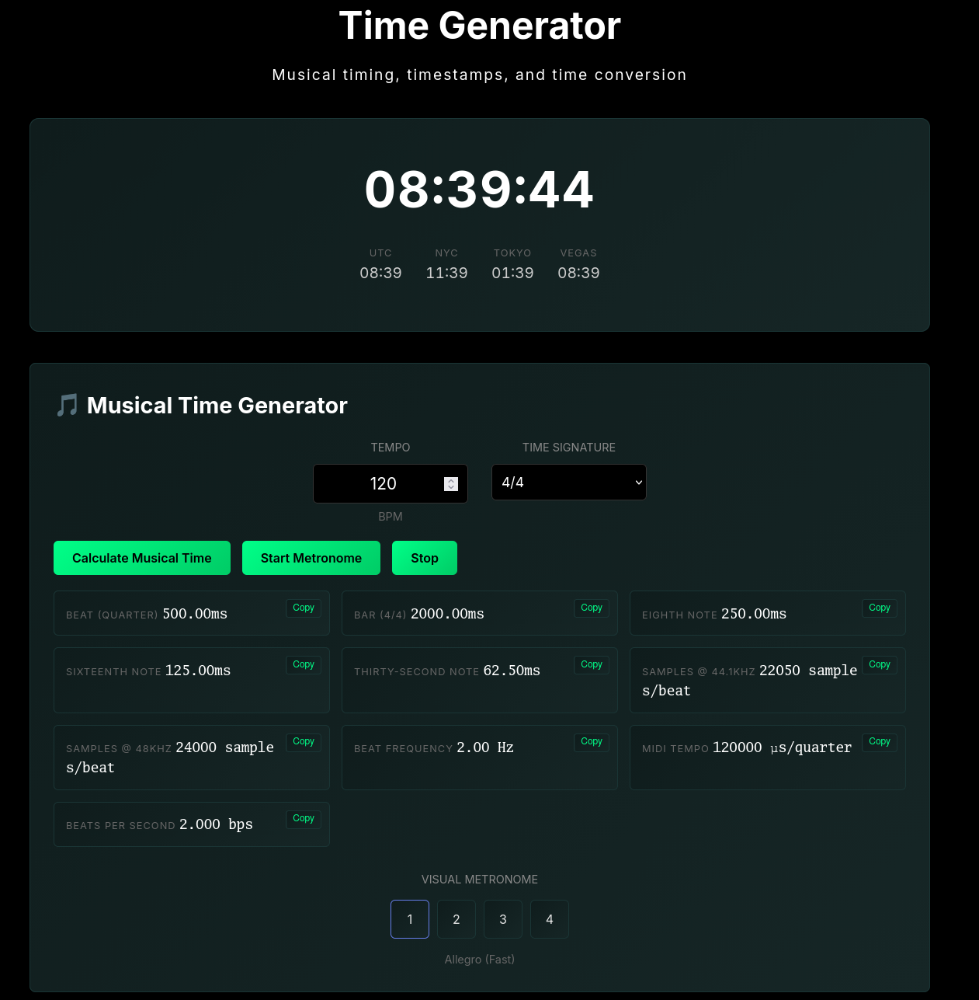
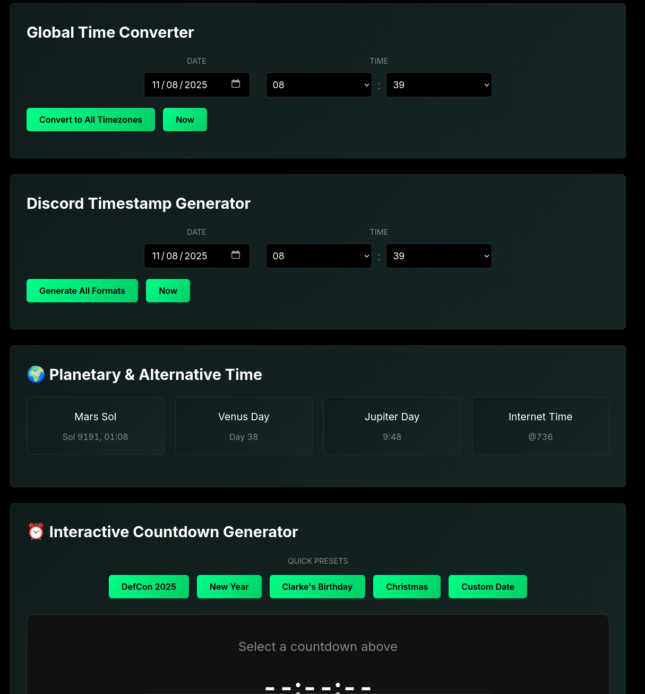

# Time Generator

**Musical timing calculator, timestamp converter, and countdown generator - all in one client-side tool.**





---

## Features

### 🎵 Musical Time Generator

The standout feature - calculate precise timing values for music production:

- **BPM to milliseconds** - Beat duration at any tempo
- **Time signatures** - 4/4, 3/4, 6/8, 7/8, and more
- **Note subdivisions** - 8th, 16th, 32nd notes in milliseconds
- **Sample-accurate timing** - Values for 44.1kHz and 48kHz sample rates
- **MIDI tempo** - Microseconds per quarter note for DAW tempo maps
- **Beat frequency** - Hz values for syncing oscillators
- **Tempo markings** - Classic Italian tempo names (Largo, Andante, Allegro, etc.)
- **Visual metronome** - Animated beat display

**Why this matters:** When syncing delays, LFOs, or sequencers to tempo in a DAW, you need exact millisecond values. Most calculators don't give you samples-per-beat at different sample rates or MIDI tempo in microseconds. This does.

### ⏱️ Unix Timestamp Converter

Convert Unix timestamps to human-readable dates and vice versa:
- Current timestamp with one click
- Multiple format outputs (ISO, locale, relative time)
- Copy any format to clipboard instantly

### 🌍 Global Time Converter

Pick a date and time, see it in all major timezones:
- UTC, New York, Tokyo, Los Angeles
- Perfect for coordinating across timezones
- Quick "Now" button for current time

### 💬 Discord Timestamp Generator

Generate Discord's dynamic timestamp syntax:
- All Discord formats (`<t:timestamp:R>`, `<t:timestamp:F>`, etc.)
- Relative time, short date, long date, time formats
- Copy-paste ready for Discord messages

### 🪐 Planetary & Alternative Time

Just for fun (but accurately calculated):
- **Mars Sol** - Martian solar day counter
- **Venus Day** - Venusian day length (243 Earth days!)
- **Jupiter Day** - Fast rotation (10 hours)
- **Internet Time** - Swatch .beat time (@000-@999)

### ⏰ Interactive Countdown Generator

Create countdowns and export embeddable HTML:
- **Quick presets** - DefCon 2025, New Year, Christmas, Clarke's Birthday
- **Custom countdowns** - Any date/time with custom event name
- **Embeddable code** - Generates standalone HTML+JS you can copy into any website
- **Live preview** - See your countdown update in real-time

**The countdown export is clever:** It generates a self-contained HTML snippet with inline JavaScript. No external dependencies, no calls to your server. Drop it anywhere and it just works.

---

## Quick Start

### Use Online

Open `index.html` in any modern browser. No installation, no build process.

### Run Locally

```bash
git clone https://github.com/clarkezyz/time-generator.git
cd time-generator
# Open index.html in your browser
```

100% client-side. No server required.

---

## Use Cases

### Music Production

**Scenario:** You're working on a track at 128 BPM and want a delay timed to dotted eighth notes.

1. Open Musical Time Generator
2. Enter 128 BPM, 4/4 time signature
3. Read the eighth note value: 234.38ms
4. Dotted eighth = 1.5 × 234.38 = 351.56ms
5. Set your delay plugin to 351.56ms

**Or:** You need to sync an LFO at 7Hz but your synth only accepts note values:
- Calculate BPM where 7Hz = beat frequency
- 7 Hz × 60 = 420 BPM
- Now you know the tempo relationship

### Audio Programming

**Scenario:** You're writing DSP code and need to calculate delay buffer sizes.

1. Enter your target BPM and sample rate
2. Get exact samples-per-beat (e.g., 22,050 samples @ 44.1kHz, 120 BPM)
3. Use this for buffer allocation in your code

### International Coordination

**Scenario:** Scheduling a meeting with team members in NYC, Tokyo, and LA.

1. Pick your preferred time
2. See what time it is for everyone instantly
3. Find a time that works (or doesn't - looking at you, Tokyo at 3am)

### Discord Server Management

**Scenario:** Announcing an event that happens at different times for different users.

1. Set event date/time
2. Generate Discord timestamp
3. Paste `<t:1234567890:R>` in Discord
4. Everyone sees the time in their local timezone automatically

### Embeddable Countdowns

**Scenario:** You're building a landing page for a product launch.

1. Set launch date
2. Generate countdown HTML
3. Copy the code
4. Paste into your HTML (no npm install, no framework, just works)

---

## Technical Details

### Architecture

**Pure client-side JavaScript** - No backend, no API calls, no tracking

**Modular design:**
- `scripts/musical-time.js` - BPM calculations and metronome
- `scripts/countdown.js` - Countdown logic and HTML generation
- `scripts/utils.js` - Shared utilities and clipboard functions

**No dependencies** - Just vanilla JavaScript and HTML/CSS (plus Google Fonts)

### Musical Time Calculations

**Beat duration formula:**
```
beatMs = 60000 / BPM
```

**Time signature adjustment:**
```
beatsPerBar = numerator
noteValue = 4 / denominator
barMs = beatMs × beatsPerBar × noteValue
```

**Subdivisions:**
- 8th note = beatMs / 2
- 16th note = beatMs / 4
- 32nd note = beatMs / 8

**Samples per beat:**
```
samples = beatMs × (sampleRate / 1000)
```

**MIDI tempo:**
```
μs per quarter note = 60,000,000 / BPM
```

### Browser Compatibility

- **Chrome/Edge** - Full support
- **Firefox** - Full support
- **Safari** - Full support
- **Mobile browsers** - Responsive design, touch-friendly

**Requirements:**
- Modern browser with JavaScript enabled
- localStorage for any future settings persistence (not currently used)

---

## File Structure

```
time-generator/
├── index.html              # Main application
├── README.md               # This file
├── LICENSE                 # MIT License
├── time-mobile.css         # Mobile responsive styles
├── scripts/
│   ├── musical-time.js     # Musical time calculator
│   ├── countdown.js        # Countdown generator
│   └── utils.js            # Shared utilities
└── screenshots/
    ├── musical.png         # Musical time generator screenshot
    └── features.png        # Features overview screenshot
```

---

## Why This Tool Exists

### The Musical Time Generator Problem

Every music producer has searched "120 bpm to milliseconds" at some point. But most calculators:
- Don't account for time signatures
- Don't give you samples-per-beat
- Don't show MIDI tempo values
- Don't help with note subdivisions

This tool was built because the author got tired of manually calculating delay times, LFO rates, and buffer sizes.

### The Countdown Generator Problem

Most countdown timers require:
- External JavaScript libraries (jQuery, Moment.js, etc.)
- API calls to a server
- Complex setup

This generates a standalone HTML snippet with inline JavaScript. Copy, paste, done. No dependencies, no server, no complexity.

### The Privacy Problem

Most time/calculator tools:
- Track your usage
- Require accounts
- Show ads
- Store data on servers

This does everything in your browser. No tracking, no accounts, no data collection. Open the source and verify.

---

## Easter Eggs

The countdown presets include:
- **DefCon 2025** - For the security conference nerds
- **Clarke's Birthday (Sept 25)** - Because the author deserves cake
- **New Year / Christmas** - Obligatory holidays

These are intentionally hardcoded as examples. They show how countdowns behave before/after the event date. Replace them or laugh at them, your choice.

---

## Development

### Architecture Principles

**No build process** - Open the HTML file, it works. No webpack, no npm, no compilation.

**Separation of concerns** - Each feature is a self-contained module.

**Progressive enhancement** - Core functionality works without JavaScript for static content display.

**Mobile-first** - Touch-friendly controls, responsive layout.

### Code Style

- ES6+ JavaScript with clear function names
- Inline comments where calculations are complex
- Copy buttons for every output value
- Visual feedback for all interactions

---

## Contributing

Contributions welcome! This project values:

- **Simplicity** - No complex dependencies
- **Privacy** - No tracking, ever
- **Utility** - Features that solve real problems
- **Accuracy** - Correct calculations matter

### Ideas for Contribution

- Additional time signature presets
- More planetary time systems (Mercury? Saturn?)
- Swing timing calculator (for jazzy subdivisions)
- Polyrhythm calculator
- Improved mobile UI
- Dark/light theme toggle
- Accessibility improvements (ARIA labels, keyboard nav)

---

## License

MIT License - See LICENSE file for details

Free for personal and commercial use. Attribution appreciated but not required.

---

## Credits

**Built by Clarke Zyz** - 2025

Because calculating 16th notes at 137 BPM shouldn't require a spreadsheet.

### Inspirations

- Frustrated music producers worldwide
- The excellent DAW tempo calculators that don't exist
- Discord's elegant timestamp system
- Mars mission enthusiasts who need Sol counters

---

## FAQ

### Why is this better than an online BPM calculator?

Most BPM calculators only do basic tempo-to-milliseconds. This gives you:
- Sample-accurate values for audio programming
- MIDI tempo for DAW automation
- All note subdivisions at once
- Visual metronome for verification

### Can I use the generated countdown code commercially?

Yes! MIT license applies to everything, including generated code. Use it however you want.

### Why are there hardcoded event dates (Clarke's birthday, DefCon)?

They're examples that demonstrate how countdowns work. Feel free to fork and change them. Or leave them - everyone deserves birthday countdown widgets.

### Does this work offline?

After the first load, yes! The only external resource is Google Fonts. Disable that or use a local font, and it's 100% offline.

### Why no dark mode?

The interface is already dark by default. Light mode could be added - PRs welcome!

### How accurate are the planetary time calculations?

**Mars Sol:** Based on actual Mars solar day length (24h 39m 35s)
**Venus Day:** 243 Earth days (yes, really)
**Jupiter Day:** ~9.93 Earth hours
**Internet Time:** Swatch's actual .beat specification

They're mathematically correct but obviously simplified (no orbital mechanics calculations).

### Can I request features?

Yes! Open an issue on GitHub. Can't promise implementation, but good ideas are always welcome.

---

**Time Generator** - Because time is too important to calculate wrong.

*Generate • Calculate • Countdown*
